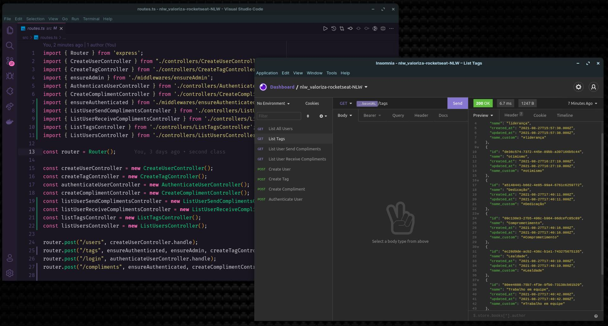

# NLW VALORIZA 🤝🏼

## ✨ Tecnologias utilizadas

- [Node.js](https://nodejs.org/en/)
- [Express](https://expressjs.com/)
- [TypeScript](https://www.typescriptlang.org/)
- [JsonWebToken](https://jwt.io/introduction)
- [TypeORM](https://typeorm.io/#/)

## 🧑🏼‍🤝‍🧑🏼 Projeto

O NLW Valoriza é um aplicação com o objetivo de elogiar os companheiros e melhorar o relacionamento entre os usuários

## 😕 Como executar

- Clone o repositório
- Rode o "yarn" para baixar as dependências
- Rode o comando "yarn typeorm migration:run" para inicializar o banco de dados
- Rode "yarn dev" para rodar a aplicação
